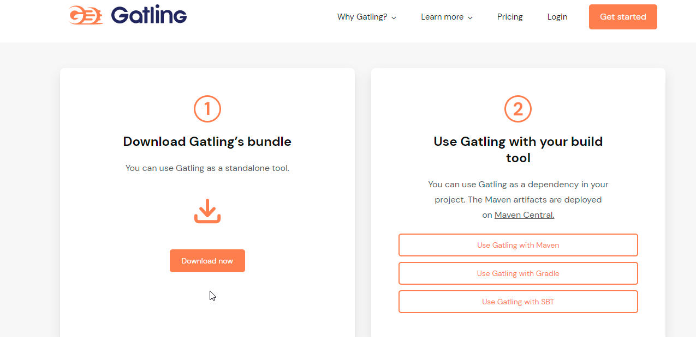
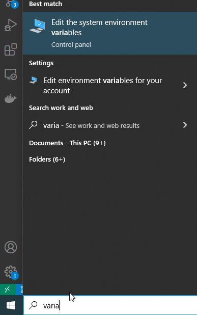
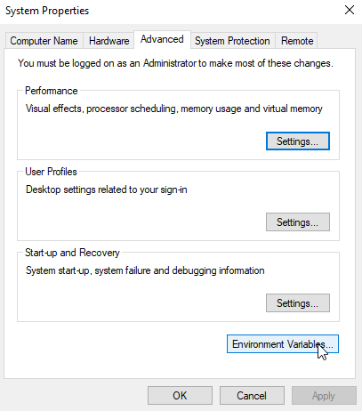
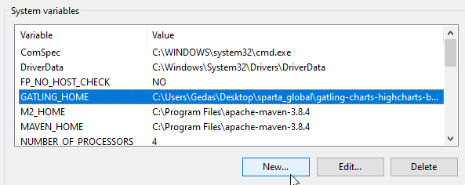
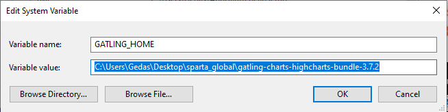
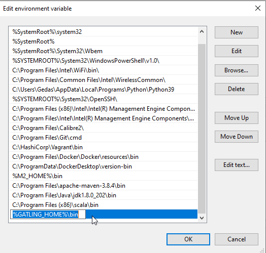
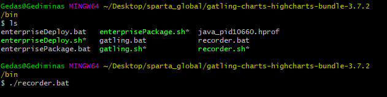
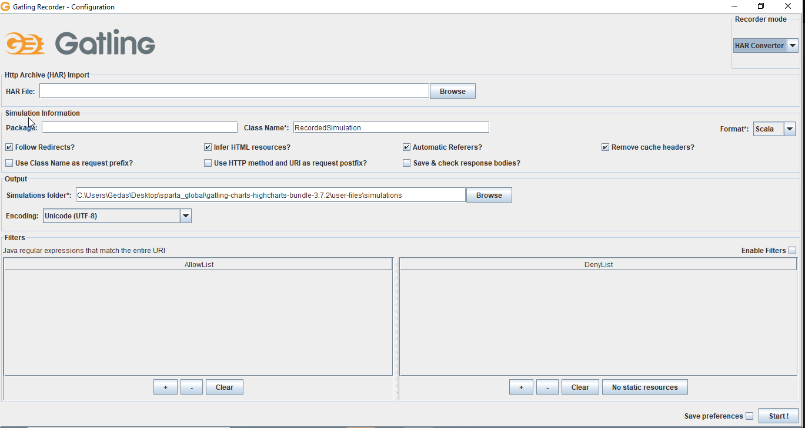

# Xmas_Sparta_Project

# Link to Tello board:
https://trello.com/b/IvYdXKDH/xmasspartaproject

# Project Rules:

## Gatling

Gatling is a load testing tool which can be used for your integrated development environment, version control systems and continuous integration solutions.

## Performance Testing

Performance testing is testing that you execute when you want to see how your system handles varying levels of throughput and traffic.

An application will often work fine when there are only handful of users active. When the number of users suddenly rises, performance problems occur. Performance testing aims to reveal (and ultimately resolve) those potential problems.

## Soak Testing

Soak testing is a type of performance evaluation that gauges how an application handles a growing number of users or increasingly taxing tasks over an extended period of time. Soak testing is both a type of nonfunctional test and a form of stress testing.

## Load Testing

Load testing is the process of putting simulated demand on software, an application or website in a way that tests or demonstrates it's behavior under various conditions.

## Stress Testing

Stress testing (sometimes called torture testing) is a form of deliberately intense or thorough testing used to determine the stability of a given system, critical infrastructure or entity. It involves testing beyond normal operational capacity, often to a breaking point, in order to observe the results.

## Spike Testing 

Spike testing is a type of performance testing in which an application receives a sudden and extreme increase or decrease in load. The goal of spike testing is to determine the behavior of a software application when it receives extreme variations in traffic.

## Doanloading gatling

- https://gatling.io/open-source/

- Unzip, save and copy the path 

- Create an invornment variable and set the path to Gatling folder

## Recording Gatling

- On Terminal cd into Gatling directory and launch a recorder.bat file 

